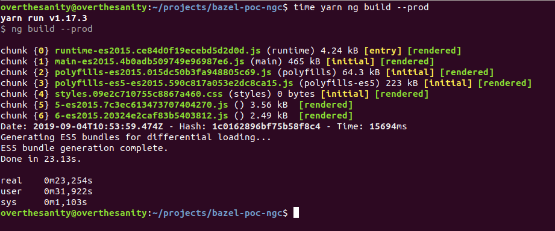
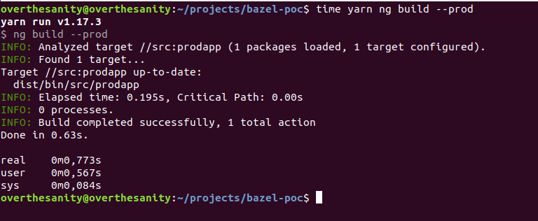

# Bazel proof of concept


> NOTE: This PoC is created before the stable Bazel release. It can change in the future so this PoC will become useless.

## PoC Requirements

Investigate Bazel tool for incremental builds in Angular. Develop initial codebase structure. Setup a simple project with lazy loading and NGXS (Redux framework). Measure development and production builds time.

## Design document

### What, why and how?

Bazel is a tool for incremental builds that can be used with any programming language. Incremental build is an abstract meaning and is based on the top of the incremental compiler. Bazel doesn’t re-compile all files. It re-compiles only those that have changed.
What’s the problem right now? TypeScript 3.4 has introduced a new compiler option called incremental. Bazel was introduced much earlier. Angular team is now wondered if the Bazel has to be default build tool in the future.

### High level cons:

* Bazel is currently in opt-preview. It means it is not stable yet
* Bazel documentation is still quite poor (especially for Angular)
* Bazel logs are also quite poor and not informative. Given the below logs, they are not very descriptive
* Bazel is complicated to setup and maintain. Bazel requires a lot of boilerplate to be created. Each Angular NgModule has to have an associated `BUILD.bazel` file. If we’ve got 200 modules then we also have to have 200 `BUILD.bazel` files
* It often happens that if Bazel fails to re-compile then it stops and requires to be re-run again. Means that the developer always has to click Ctrl + C and run Bazel again

## Implementation

### Production-level code

Initial codebase structure was developed and consisted of 2 lazy modules, these are `home` and `dashboard`.Each lazy module has to have `BUILD.bazel` files.

Let's look at the `BUILD.bazel` file structure for the `home` module:

```python
load("@npm_angular_bazel//:index.bzl", "ng_module")
load("@io_bazel_rules_sass//:defs.bzl", "sass_binary")
 
package(default_visibility = ["//:__subpackages__"])
 
sass_binary(
   name = "home_component_styles",
   src = "home.component.scss"
)
 
ng_module(
   name = "home",
   srcs = [
       "home.component.ts",
       "home-routing.module.ts",
       "home.module.ts"
   ],
   assets = [
       "home.component.html",
       ":home_component_styles"
   ],
   deps = [
       "@npm//@angular/core",
       "@npm//@angular/router",
       "@npm//@angular/common"
   ]
)
```

`bazel` files Python-like files. `load` statement is used for loading extensions. The above code will load `index.bzl` file from the `node_modules/@angular/bazel` and will add the `ng_module` macros to the environment.

`ng_module` is a macro that accepts `name`, `srcs`, `assets`, `deps` attributes:
* `name` is the name of our target
* `srcs` is a list of files to include in the build
* `assets` is a self-descriptive name
* `deps` is a list of another targets that our `home` target is dependend on

Also Bazel deals with already compiled `NgModuleFactory` files and the developer has to add `.ngfactory` suffix even if a file doesn’t exist. IDE screams out:

```ts
const routes: Routes = [
 {
   path: '',
   loadChildren: () =>
     import('./pages/home/home.module.ngfactory').then(m => m.HomeModuleNgFactory)
 }
];
```

This code is compiled without errors (even if the `home.module.ngfactory` doesn’t exist in the file system).

### Third-party Angular compatible libraries

I chose the NGXS library to integrate in. How does Bazel cooperates with third-party libraries? Bazel relies on the compilation of third-party libraries to happen outside of compiling our app.

This can be done by using a `postinstall` script in `package.json` which will run the `ngc` compiler.

Currently every Bazel project has an `angular-metadata.tsconfig.json` file where we have to include third-party libraries to be compiled by the `ngc`:

```json
"include": [
  "node_modules/@ngxs/**/*"
]
```

And the command for running `ngc`:

```console
yarn ngc -p ./angular-metadata.tsconfig.json
```

So steps we have to do when installing third-party deps:

* `yarn add @ngxs/{store,logger-plugin}`
* Edit `angular-metadata.tsconfig.json` file and add path to the `@ngxs/**/*` folder to the `include` list
* Run `ngc -p ./angular-metadata.tsconfig.json`

### How to actually use Bazel?

Given the following file structure:

```
— src
    — main.ts
    — on-load.ts
    — BUILD.bazel
— BUILD.bazel
— WORKSPACE
```

You can mention that `BUILD.bazel` files are located mostly everywhere. Yeah, that's the point of Bazel and its keynote. When you work with Webpack you only have to provide an `entry` file, right. Later, the Webpack finds out about your dependendencies by `import` statements. If we've got 2 files:

```ts
// main.ts
import { onLoad } from './on-load';

window.addEventListener('load', onLoad);

// on-load.ts
export function onLoad() {}
```

And the `main.ts` is an `entry` in our `webpack.config.js` then the Webpack automatically knows about the `on-load.ts` file just because of `import` statement (as Webpack parses files and creates AST).

Such approach will not work with Bazel as a developer HAS to tell Bazel what files should be packaged. Let's have a look how could we package these 2 files, we would need a `BUILD.bazel` file:

```python
load("@npm_bazel_typescript//:defs.bzl", "ts_library")

package(default_visibility = ["//:__subpackages__"])

ts_library(
    name = "main",
    srcs = [
        "main.ts",
        "on-load.ts"
    ]
)
```

That's it. From Bazel docs:

> The `ts_library` rule compiles one package of TypeScript code at a time.

So `ts_library` is just a macro where we can provide a set of attributes that will help Bazel to compile and package our files.

## Summary

### Bazel pros & cons compared to Webpack (default tool)

|                               | Bazel  | Webpack  |
| ------------------------------|:------:| -------: |
| Complexity                    | High   | Low      |
| Extensibility                 | Low    | High     |
| Boilerplate                   | High   | Low      |
| Portability                   | Medium | High     |
| Build speed                   | High   | Medium   |
| User-friendly (accessibility) | Low    | High     |

Webpack is very extensible and configurable, you can provide custom loaders for any type of file to be proceeded by Webpack. There is no doubt that Webpack is easier than Bazel and it's much easier to maintain and accompany apps using Webpack. You only have to main the `webpack.config.js` file except of maintaining a lot of `BUILD.bazel` files, that can be painful.

### Benchmarks

App with 2 lazy modules built with Webpack:



Built with Bazel:


