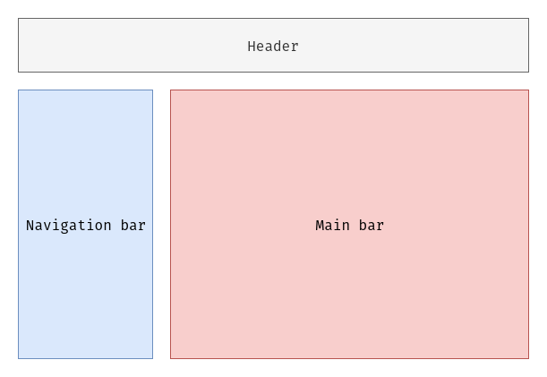
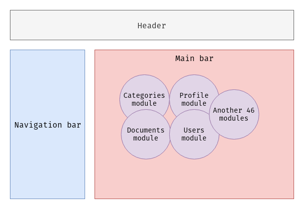
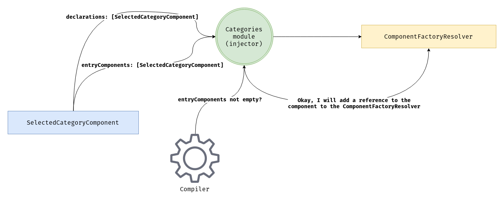
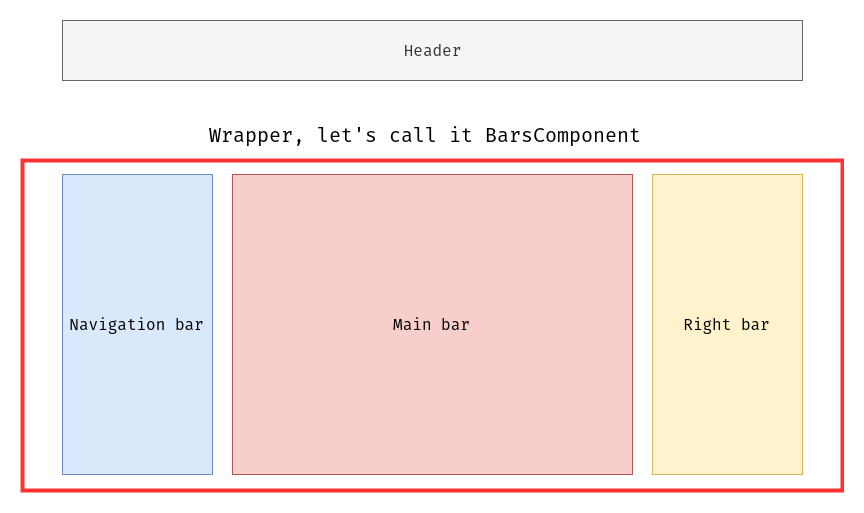
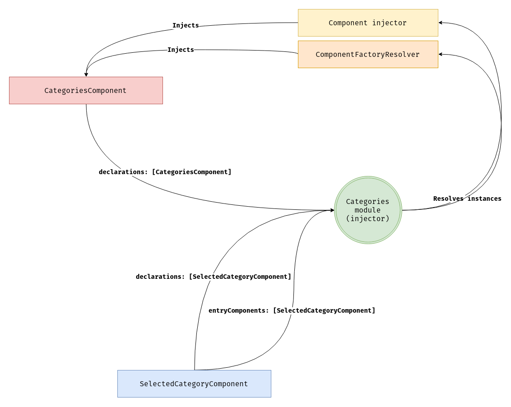
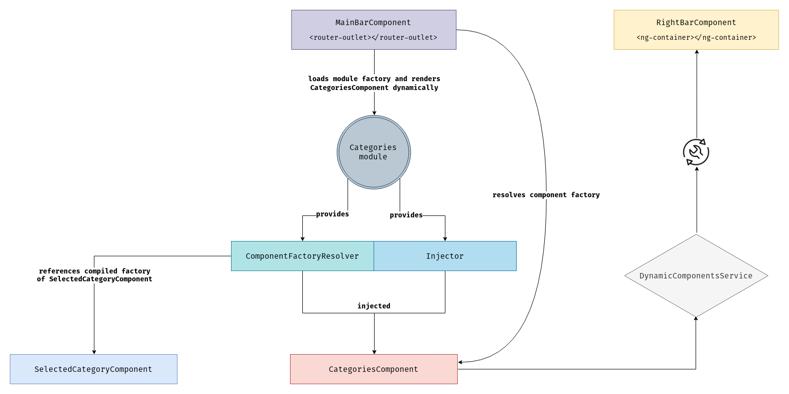

# Dynamic components

## Table of contents

* [Dynamic components in Angular architectures](#dynamic-components-in-angular-architectures)

# Dynamic components in Angular architectures

Imagine such simple application structure:



So we've got a `header` with some buttons, we've got a `navigation bar` with links and we've got a `main bar` where Angular performs routing. For example, the template code would be as follows:

```html
<app-header></app-header>
 
<app-navigation-bar></app-navigation-bar>
 
<app-main-bar>
  <router-outlet></router-outlet>
</app-main-bar>
```

Imagine the situation that you have 50 modules that are loaded on demand and all of them will be inside the `app-main-bar`:



15 out of 50 modules contain business logic that allows you to select an entity and see information about it, as well as the editing form on the right bar that was not visible before. NOTICE, we can't use named router outlets as they don't work with child lazy loading modules. In this case I suggest using the below approach:


The template code would be as follows:

```html
<app-header></app-header>
 
<app-navigation-bar></app-navigation-bar>
 
<app-main-bar>
  <router-outlet></router-outlet>
</app-main-bar>
 
<app-right-bar>
  <app-selected-category *ngIf="url === '/categories'"></app-selected-category>
</app-right-bar>
```

NOTE, this is just an `abstract pseudo-code`!

How to protect a template from complex business logic for processing a large number of components and conditions? The solution is `dynamic components`.

Dynamic components are those components that can be initialized at runtime using manual tools. This means that Angular does not know at compile time where to project these components.

Dynamic components are those components that you declare in the module `entryComponents` property.

What are modules? Modules are `INJECTORS`, nothing complicated, modules are compiled into factories, those factories return module definitions that know how to provide necessary dependencies for you. For example:

```typescript
@NgModule({
    imports: [HttpClientModule]
})
export class AppModule {}
```

Is compiled into:

```typescript
const AppNgModuleFactory = createModuleFactory(AppModule, [], () => {
  return moduleDef([
    moduleProviderDef(4608, HttpClient, HttpClient, []),
    moduleProviderDef(
      5120,
      HTTP_INTERCEPTORS,
      (interceptor) => [interceptor],
      []
    )
  ]);
});
```

`4608` is `4096 | 512 = 4608`, where `4096` is `NodeFlags.LazyProvider`, and `512` is `NodeFlags.TypeClassProvider`, this is a bitmask that describes the type of provider. And `5120` is `4096 | 1024`, where `1024` is the `NodeFlags.TypeFactoryProvider`.

Returning to our example after a lyrical digression, everything that we declare in the `entryComponents` property tells the compiler to add references to these components in the `ComponentFactoryResolver` class of this module. P.S. - each module has its own `ComponentFactoryResolver`.



In order to correctly implement this business logic, we need a container (where we project our components) and a service. Our right bar component would look like this:

```typescript
import { Component, ChangeDetectionStrategy } from '@angular/core';
 
@Component({
  selector: 'app-right-bar',
  template: `
    <div class="content">
      <ng-content></ng-content>
    </div>
  `,
  styleUrls: ['./right-bar.component.scss'],
  changeDetection: ChangeDetectionStrategy.OnPush
})
export class RightBarComponent {}
```

We will declare this component in the template as follows:

```html
<app-right-bar>
  <ng-container #rightBarContainer></ng-container>
</app-right-bar>
```

Using `ng-content` allows us to get a reference to the container before the `app-right-bar` component is fully rendered. We also need some wrapper around bars:



Let's write some dummy code for our `BarsComponent`:

```typescript
import {
  Component,
  ChangeDetectionStrategy,
  ViewChild,
  ViewContainerRef,
  OnInit
} from '@angular/core';
 
import { DynamicComponentsService } from '@app/shared/services';
 
@Component({
  selector: 'app-bars',
  template: `
    <app-navigation-bar></app-navigation-bar>
 
    <app-main-bar>
      <router-outlet></router-outlet>
    </app-main-bar>
 
    <app-right-bar>
      <ng-container #rightBarContainer></ng-container>
    </app-right-bar>
  `,
  styleUrls: ['./bars.component.scss'],
  changeDetection: ChangeDetectionStrategy.OnPush
})
export class BarsComponent implements OnInit {
  @ViewChild('rightBarContainer', { read: ViewContainerRef })
  public rightBarContainer: ViewContainerRef = null!;
 
  // Angular 8+
  @ViewChild('rightBarContainer', { read: ViewContainerRef, static: true })
  public rightBarContainer: ViewContainerRef = null!;
 
  constructor(private dynamicComponentsService: DynamicComponentsService) {}
 
  public ngOnInit(): void {
    this.dynamicComponentsService.setRightBarContainer(this.rightBarContainer);
  }
}
```

I also want a service that will encapsulate all business logic related to the component initialization. Also this service has to provide some lightweight public API so developers shouldn't care what's going on under the hood, let's call it `DynamicComponentsService`:

```typescript
import {
  Injectable,
  ViewContainerRef,
  Type,
  ComponentFactoryResolver,
  Injector,
  ComponentFactory,
  ComponentRef
} from '@angular/core';
 
@Injectable({ providedIn: 'root' })
export class DynamicComponentsService {
  public get isRightBarComponentProjected(): boolean {
    return !!this.rightBarContainer && !!this.rightBarContainer.length;
  }
 
  /**
   * Reference to the right bar's `ng-container` wrapper instance, wiil be
   * set up after DOM is queried
   */
  private rightBarContainer: ViewContainerRef | null = null;
 
  public setRightBarContainer(rightBarContainer: ViewContainerRef): void {
    this.rightBarContainer = rightBarContainer;
  }
 
  public createRightBarComponent<T>(
    component: Type<T>,
    resolver: ComponentFactoryResolver,
    injector: Injector
  ): void {
    if (!this.rightBarContainer || this.isRightBarComponentProjected) {
      return;
    }
 
    const factory: ComponentFactory<T> = resolver.resolveComponentFactory(component);
    // `0` is an index
    const ref: ComponentRef<T> = this.rightBarContainer.createComponent(factory, 0, injector);
    // As this component is embedded dynamically into `ng-container` - we have to be sure
    // that it's been rendered w/o side effects
    ref.changeDetectorRef.markForCheck();
  }
 
  public destroyRightBarComponent(): void {
    if (this.rightBarContainer && this.rightBarContainer.length) {
      this.rightBarContainer.clear();
    }
  }
}
```

We also pass the injector argument, thereby our dynamic component gains access to the DI system.



The `CategoriesComponent` is our "routed" component, that we would declare in the routes of `CategoriesRoutingModule`. It's code would be as follows:

```typescript
import {
  Component,
  ChangeDetectionStrategy,
  OnDestroy,
  ComponentFactoryResolver,
  Injector
} from '@angular/core';
 
import { DynamicComponentsService } from '@app/shared/services';
 
import { SelectedCategoryComponent } from './components';
 
@Component({
  selector: 'app-categories',
  templateUrl: './categories.component.html',
  styleUrls: ['./categories.component.scss'],
  changeDetection: ChangeDetectionStrategy.OnPush
})
export class CategoriesComponent implements OnDestroy {
  constructor(
    resolver: ComponentFactoryResolver,
    injector: Injector,
    private dynamicComponentsService: DynamicComponentsService
  ) {
    dynamicComponentsService.createRightBarComponent(SelectedCategoryComponent, resolver, injector);
  }
 
  public ngOnDestroy(): void {
    this.dynamicComponentsService.destroyRightBarComponent();
  }
}
```



Dynamic components are a very stable approach for isolating complex templating logic in code. All dynamic components should be bundled in separate chunks with modules, they are bound to.
