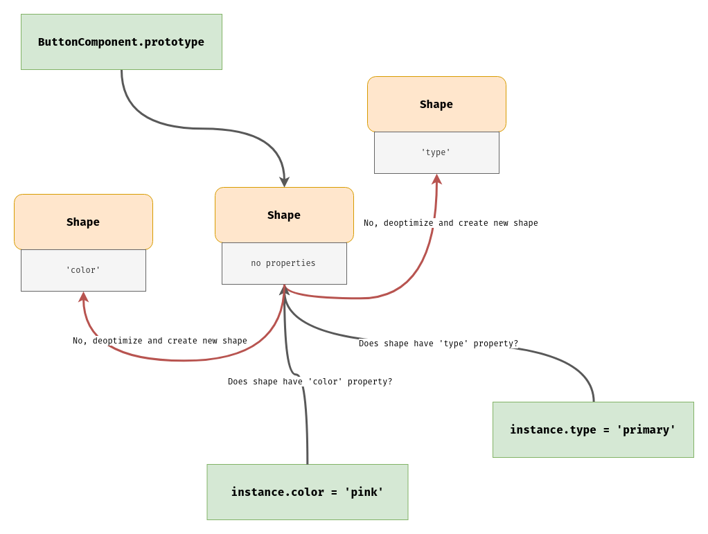

# V8

## Spread operator

Don't use `...` spread operator with arrays.

The spread operator is fast and optimized in Chrome but very slow in Mozilla/Safari/Opera. TypeScript replaces `...` with `__spread` function from the `tslib` package which uses `Array.prototype.concat` (also slower).

```typescript
function overrideProviders(providers: Providers[]): Provider[] {
  const overridden = [...providers]; // BAD

  const overridden = [].concat(providers); // BAD

  const overridden = providers.slice(); // GOOD

  // do something with overridden...

  return overridden;
}
```

You will lose nothing if you use `slice` instead of other methods, the readability of the code will remain the same.

You still can use `...` with objects. TypeScript replaces `...` with `__assig`n that references `Object.assign`.

## Splice power

Don't be afraid of `Array.prototype.splice`.

`Array.prototype.splice` is a super fast function. Always use it when you need to remove anything by index.


The compiler is able to optimize this function in the main thread in just 0.3 milliseconds!

```typescript
class Users {
  private users: User[] = [{ ... }, { ... }, { ... }, { ... }];

  // BAD
  public removeUser(userToRemove: User): void {
    this.users = this.users.filter((user) => user !== userToRemove);
  }

  // BAD
  public removeUser(userToRemove: User): void {
    const userToRemoveIndex = this.users.indexOf(userToRemove);
    this.users = this.users.filter((_, index) => index !== userToRemoveIndex);
  }

  // BAD
  public removeUser(userToRemove: User): void {
    const userToRemoveIndex = this.users.indexOf(userToRemove);

    this.users = [
      ...this.users.slice(0, userToRemoveIndex),
      ...this.users.slice(userToRemoveIndex + 1)
    ];
  }

  // GOOD
  public removeUser(userToRemove: User): void {
    const userToRemoveIndex = this.users.indexOf(userToRemove);
    const users = this.users.slice();
    users.splice(userToRemoveIndex, 1);
    this.users = users; // GOOD, we also change the reference
  }
}
```

## Stop using forEach

`forEach` itself is written in JS (https://github.com/v8/v8/blob/ba41489da55a3484ceb5ac84c07de546578a2161/src/array.js#L1176-L1205). There are NO reasons to use `forEach`, believe me. Use `for-of` or single `for`:

```typescript
export class CountriesService implements Mutateble<Country> {
  public mutateSource(
    countries: Country[],
    key: keyof Country,
    value: Country[keyof Country]
  ): Country[] {
    countries.forEach((country) => {
      country[key] = value;
    }); // BAD

    for (const country of countries) {
      country[key] = value;
    } // GOOD

    for (let i = 0, length = countries.length; i < length; i++) {
      const country = countries[i];
      country[key] = value;
    } // GOOD

    return countries;
  }
}
```

## Avoid dynamic properties

Imagine such component:

```typescript
import { Component, ChangeDetectionStrategy } from '@angular/core';

@Component({
  selector: 'app-button',
  templateUrl: './button.component.html',
  styleUrls: ['./button.component.scss'],
  changeDetection: ChangeDetectionStrategy.OnPush
})
export class ButtonComponent {
  @Input()
  public type: string;

  @Input()
  public color: string;
}
```

You would use this component in some way:

```html
<app-button type="primary"></app-button>
<app-button color="pink"></app-button>
```

After instantiating the component class via `createDirectiveInstance`, Angular invokes function called `checkAndUpdateDirective` which loops through the `ViewDefinition` bindings and sets values to properties:

```typescript
providerData.instance[propName] = value;
```

Where `propName` is either `type` or `color`. Those properties are dynamic because they're not initialized in the constructor. The above code is a syntactic sugar over:

```typescript
function ButtonComponent() {}
```

This is how V8 works, function constructors are compiled into internal structures, there is no possibility to see a compiled code but it looks kinda like:

```c++
struct ButtonComponent_0 {};
```

C++ doesn't support dynamic members, you can't add a non-existing property:

```c++
struct ButtonComponent_0 {};

ButtonComponent_0* buttonComponent = new ButtonComponent_0();
buttonComponent->type = "primary";
```

The compiler will throw:

```console
error: 'struct ButtonComponent' has no member named 'type'
```

Also C++ doesn't support static reflection. V8 has its own internal dynamic reflection which forses V8 engine to copy the previous struct and create the new one with `type` property:

```c++
struct ButtonComponent_1 {
  std::string type;
};
```

Those components will have different shapes also called as `hidden classes`. We don't notice that but V8 does a lot of work:



To avoid such behavior - we SHOULD initialize properties in the constructor:

```typescript
export class ButtonComponent {
  @Input()
  public type: string | null = null;

  @Input()
  public color: string | null = null;
}
```

Will be compiled into:

```typescript
function ButtonComponent() {
  this.type = null;
  this.color = null;
}
```

Even if we bind only `type` property and the `color` member is unused - let it be 😎. The main point is that the `color` property exists and V8 will not create another shape.

TypeScript compiler has an option called `strictPropertyInitialization` (Ensure non-undefined class properties are initialized in the constructor).
